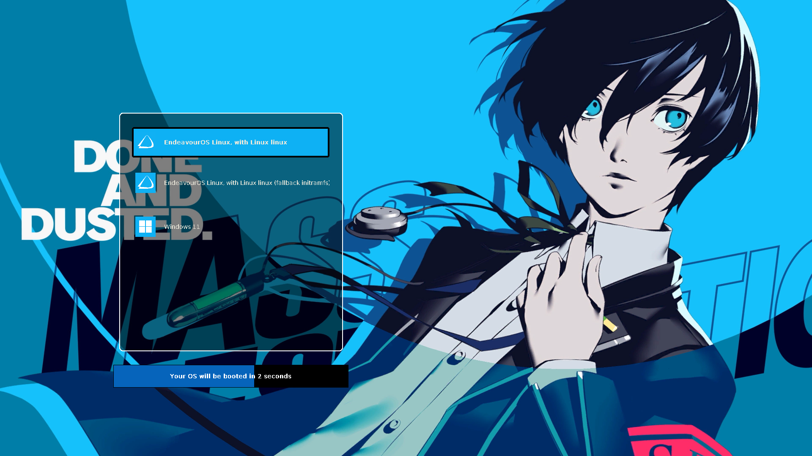

# Persona 3 Reload Grub Themes

This repository contains **11 GRUB themes** inspired by the P3R's *All Out Attack* sequence. The themes are based on the work of [SiriusAhu](https://github.com/SiriusAhu/Persona_5_Royal_Grub_Themes), whose Persona 5 Royal theme served as a helpful foundation. I am not a highly technical person, but I created these themes with care and attention to detail.

The DLC, which was exclusively released for `P3R`, adds *two additional themes*.

The *All Out Attack* images are not created by me — credit goes to the P3R team.
If you are the owner of these images and want them removed, please contact me and I will take them down immediately.



# Installation

An `install.sh` script is included to simplify installation. You can also install the themes manually if you want.

## 1) Install using the script

Run `install.sh` and choose the theme you want.

> :warning:Important: You must run the script with `sudo`. Otherwise the system cannot copy files to `/boot/grub/themes` or modify `etc/default/grub` to set the theme. Open the terminal where the install script is located.

```bash
sudo bash install.sh
```

## 2) Manual installation

1. Download the `tar.gz` file from the release page.

2. Extract it and copy the folder to `/boot/grub/themes`.

3. Edit `/etc/default/grub` and set `GRUB_THEME=/boot/grub/themes/<theme-folder>/theme.txt`

4. Update grub. 
    - Debian/Ubuntu/etc.: 
    ```bash
    sudo update-grub
    ```
    - Arch-based systems: 
    ```bash
    sudo grub-mkconfig -o /boot/grub/grub.cfg
    ```

# Images & Icons

1. **All out Attack** images
    - https://i.imgur.com/a/aH0D8FY

2. Icons
    - https://www.reddit.com/r/linux/comments/nt1tm9/i_made_a_uniform_icon_set_of_linux_distribution/

> I edited the icons to match the colour with the image's colour. Some icons are not from the link above.

# Additional icon sources

- CachyOS icon:
    https://github.com/CachyOS/CachyOS-icons/tree/master

- GuideOS icon (German, beginner-friendly distro):
    https://guideos.de/download/
    
> **Note:** I made the Windows 11 icon seperatly.
